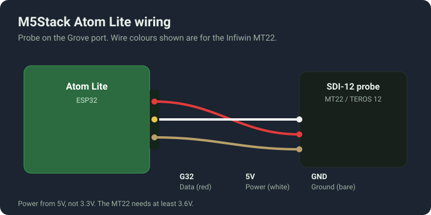
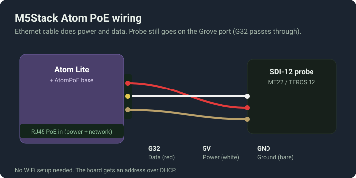

# Wiring and placement

Everything about getting the probe connected to the board and into the substrate. Read the wire colours section before you connect anything. The colour codes are not the same between sensor brands and getting it wrong can damage the data pin.

## The one thing that breaks most builds

This project uses a half-duplex UART, which only works on the ESP32 with the esp-idf framework and the ssieb fork the config already pulls in. If you try to run it on an ESP8266, or you switch the framework to Arduino, the build still succeeds and the probe just never answers. The device boots, joins WiFi, serves the web page, and every reading sits at unknown. If that is what you are seeing, this is almost always why. Stay on the board files in this repo and do not change the framework.

## Wire colours

The wire that carries data is a different colour on every brand. Only the ground is consistent. Meter each wire against the sensor manual before you power anything up.

| Function | Infiwin MT22 | METER TEROS 12 | Growlink TerraLink (M8) |
|---|---|---|---|
| SDI-12 data | Red | Orange | White (pin 2) |
| Power | White | Brown | Red (pin 1) |
| Ground | Bare | Bare | Bare (pin 3) |

On the MT22 the red wire is data, not power. If you wire it the way you would wire anything else, red to the 5V rail, you put 5V on the data pin. Check it.

Power the probe from 5V. The MT22 wants somewhere between 3.6V and 16V, so the 3.3V rail is not enough. The Grove ports on the M5 boards run 5V, which is correct.

## Board wiring

Each board brings the SDI-12 data line out on a different pin. The data pin is the only setting you need to match in your config, through the sdi12_data_pin substitution. Power and ground are the 5V and GND on the same connector.

### M5Stack Atom Lite

Data on G32, which is the Grove port. This is the default, so the stock config needs no changes.

### M5Stack AtomS3 Lite

Data on G1 (Grove port). The device file sets sdi12_data_pin to GPIO1 for you.

### M5Stack Atom PoE

Data on G32. The PoE base passes the Grove port straight through, so the probe wiring is the same as the bare Atom Lite. The ethernet cable carries both power and network, so there is no WiFi to set up. The board comes up on DHCP.

### M5Stack Dial

Data on G2, which is Port B. Port A is left alone because the Dial uses it for its internal I2C. The device file sets sdi12_data_pin to GPIO2.

### Generic ESP32

Data defaults to GPIO16. Any free GPIO works, just set sdi12_data_pin to match and stay off the strapping pins (GPIO0, 2, 12, 15) unless you know what you are doing. Power the probe from the 5V or VIN pin.

## Sensor placement

Where you put the probe matters as much as calibration. The sensor reads a volume of substrate around the rods, roughly the size of a small orange, so it needs to sit in representative media, not in an air gap and not jammed against the block wall.

General rules for every substrate:

- Full rod insertion. The whole length of the prongs goes in. A partly inserted probe reads low and noisy.
- Away from the dripper. Keep the rods at least a few centimetres from where the emitter lands so you are measuring the root zone, not the wet spot under the dripper.
- Away from the main stem. A couple of centimetres out from the stem, in the root mass, not crushed against the base.
- One consistent spot. Pick a position and use the same one on every block so your numbers are comparable plant to plant.
- Rods horizontal or on a slight downward angle. This stops water tracking down the rods and pooling, which would read high.

### Rockwool cube (small blocks, propagation and early veg)

Push the rods in through the side of the cube, horizontal, about halfway up the height. Halfway up gives you the average of the cube rather than the wet bottom or the dry top. Keep clear of the drip line.

### Rockwool slab

Insert through the top face at a slight downward angle, or through the side, so the rods sit in the middle third of the slab depth. That middle band is where the roots live and where dryback actually happens. Avoid the very bottom of the slab where water always pools, and avoid the top skin where it dries out first. Put it near a healthy plant, not at the dry end of the slab.

### Coco pots

Depth depends on pot size. You want the rods in the main root zone, which is the middle of the pot by depth, not the surface and not the drainage layer at the bottom.

- Small pots up to about 1 gallon: insert from the top at an angle so the rods reach the middle of the pot.
- Larger pots, 2 to 5 gallon: go in through the side at roughly a third to halfway up. In a tall pot the top dries and the bottom holds water, so mid-height reads the zone the plant actually feeds from.
- One probe reads one pot. If your pots vary, sample a typical one, not your best or worst.

Once the probe is placed, leave it. Moving it resets your baseline and you will chase readings that only changed because the rods moved.
